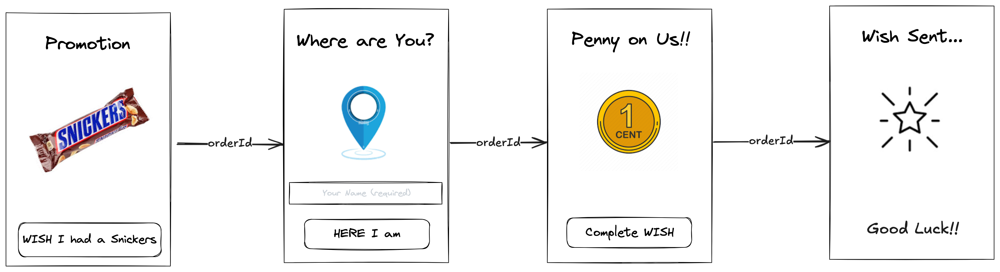

<!-- @import "[TOC]" {cmd="toc" depthFrom=1 depthTo=6 orderedList=false} -->

<!-- code_chunk_output -->

- [Vibe Coding Notes](#vibe-coding-notes)
  - [Using WindSurf to Help Build Next.js App](#using-windsurf-to-help-build-nextjs-app)
    - [Some Resources](#some-resources)
    - [Prerequisites](#prerequisites)
    - [Getting Started - Baseline](#getting-started---baseline)
      - [Create the App](#create-the-app)
      - [Dockerize the app](#dockerize-the-app)
      - [Update App Script and Docker Compose files](#update-app-script-and-docker-compose-files)
    - [Code Vibing with Windsurf](#code-vibing-with-windsurf)
      - [Phase 1 - Create Screen Flow and Layout](#phase-1---create-screen-flow-and-layout)
        - [Result](#result)
      - [Phase 2 - Integrate with Snack Command APIs](#phase-2---integrate-with-snack-command-apis)

<!-- /code_chunk_output -->


# Vibe Coding Notes

## Using WindSurf to Help Build Next.js App

For my Open Source North 2025 talk I had the idea of building a 
*Snickers Promotion App* to engage the audience and encorporate snacks into the "Snacks Unlimited" solution journey.

I decided to explore "vibe coding" with an AI Assistant to accelerate the development of the promotion responsive web app. Speicifically using Windsurf (formerly Codeium) with Cascade AI Chatbot as an Intellij plugin.

I also experimented with using the Windsurf AI IDE directly with my Next.js project.

Here are my findings:

### Some Resources

* [YouTube Demo - Windsurf and Next.js](https://www.youtube.com/watch?v=qqTN5uMOfRo)

### Prerequisites

Before you begin, make sure your system meets the following requirements:
* Node.js 18.18 or later.
* macOS, Windows (including WSL), or Linux.

NOTE: I used Node v22.14.0 and NPM 10.9.2.

### Getting Started - Baseline

First steps were creating the the Next.js App and Dockerizing it as part of the *Snacks Unlimited Playground*. 

#### Create the App

```
$ npx create-next-app@latest
✔ What is your project named? snickers-promotion-app
✔ Would you like to use TypeScript? Yes
✔ Would you like to use ESLint? No
✔ Would you like to use Tailwind CSS? Yes
✔ Would you like your code inside a `src/` directory? No
✔ Would you like to use App Router? (recommended) Yes
✔ Would you like to use Turbopack for `next dev`? Yes
✔ Would you like to customize the import alias (`@/*` by default)? No
```

#### Dockerize the app

I started with using Cascade in chat mode to help me through this. I started with the prompt:
```
In the Next.js project snickers-promotion-app how do I Dockerize it?
```

It gave me a simple Dockerfile example and I was able to successfully build an image. BUT is was 1.85GB in size.

I ended up following the Next.js Deploy documentation which recommended I clone their preferred [Dockerfile](https://github.com/vercel/next.js/blob/canary/examples/with-docker/Dockerfile).

Along with the Dockerfile I had the add the following line to *next.confif.ts*

```
import type { NextConfig } from "next";

const nextConfig: NextConfig = {
  /* config options here */
  output: 'standalone' // I had to add this line
};

export default nextConfig;
```

After that all was well

#### Update App Script and Docker Compose files

I then updated *./workspace/apps* script and *./workspace/docker/docker-compose-apps.yml*

---

### Code Vibing with Windsurf

Using Cascade - Write Mode with*Claude 3.7 Sonnet (Thinking)*

#### Phase 1 - Create Screen Flow and Layout

[Prom](./vibe-coding-conversations/promotion-app-phase1.md)

##### Result

Fully functioning page with cards and a swipe navigation flow that matched this UI Wireframe:



#### Phase 2 - Integrate with Snack Command APIs
